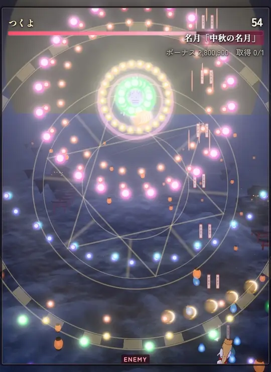
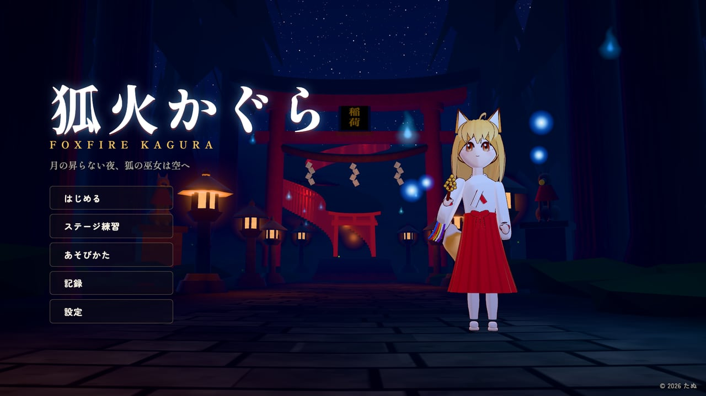
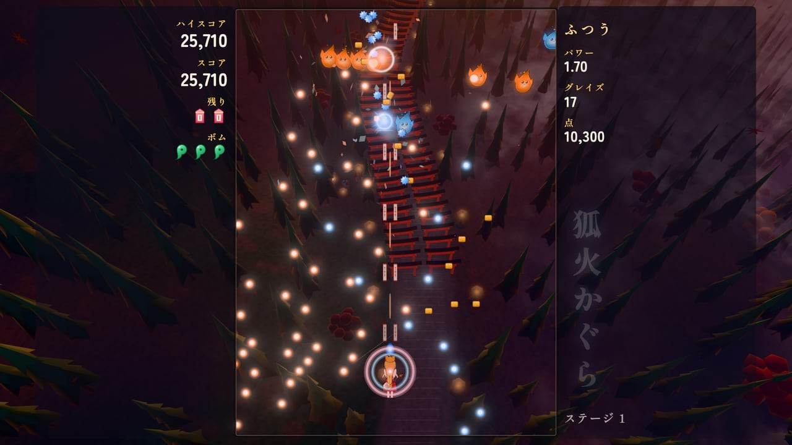
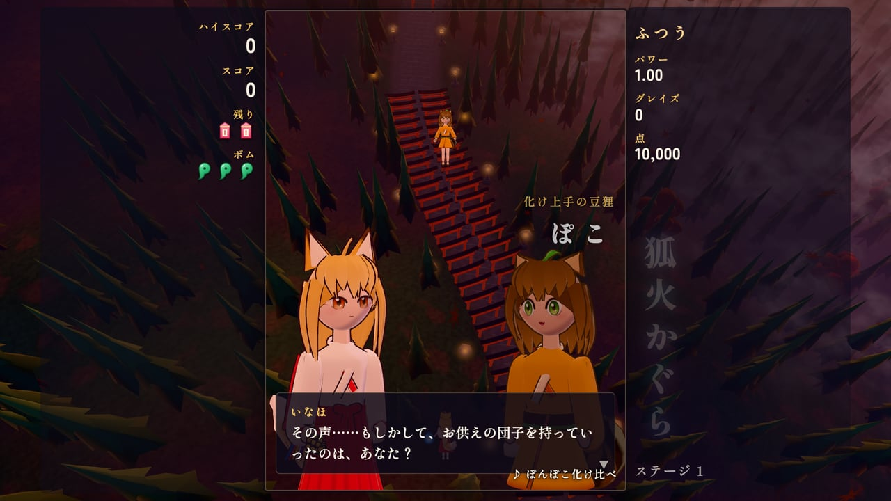
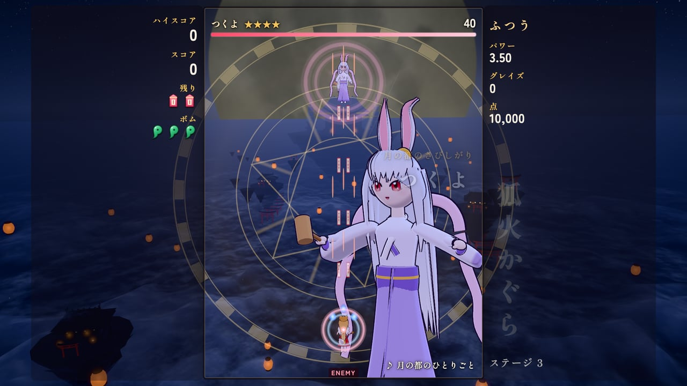
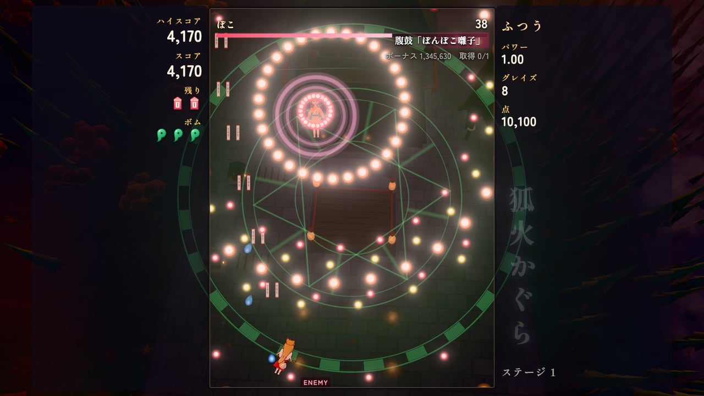
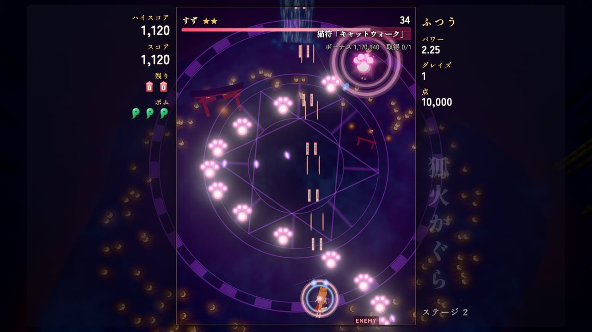
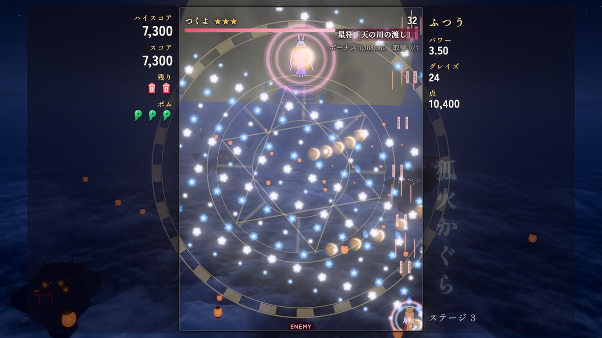
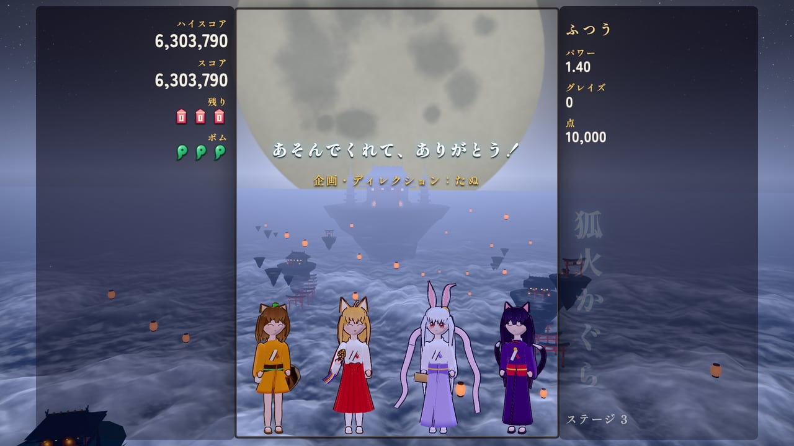

# 狐火かぐら — FOXFIRE KAGURA

月の昇らない中秋の夜、ケモ耳の狐の巫女が夜空を駆ける。ブラウザで遊べる 3D の縦スクロール弾幕シューティング。

[](https://www.anthropic.com/claude)
[](./LICENSE)

<p align="center">
  
</p>

**Claude Code × Claude Opus 5.5（MAX）** で作りました。

稲荷の見習い巫女「いなほ」を操り、敵の弾幕をよけながら撃ち返して、3 つのステージの奥で待つボスたちに挑む縦スクロール弾幕シューティングです。
主人公・ボス・道中の妖怪は 3D のモデルで、千本鳥居の参道、灯籠の流れる竹林の川、雲海に浮かぶ月の社を 3D の背景の中で飛んでいきます。ボスとの会話は 3D の立ち絵で、スペルカードを宣言するとカットインが入ります。
キャラクター・背景・弾・音楽・効果音は、画像や音声のファイルを使わず、すべてコードで生成しています。
日本語と英語に対応しています（ブラウザの言語に合わせて始まり、設定の「言語」で切り替えられます）。English follows below.

## スクリーンショット

<table>
  <tr>
    <td width="50%"><br><sub>タイトル画面。月のない星空の下、稲荷の参道に神楽鈴を持ったいなほが立ちます。</sub></td>
    <td width="50%"><br><sub>ステージ 1「夕暮れの千本鳥居」。狐火の妖怪たちが、鳥居の連なる参道の上を飛んできます。</sub></td>
  </tr>
  <tr>
    <td><br><sub>ボスとの会話は 3D の立ち絵。話している側だけ明るくなり、口が動き、表情が変わります。</sub></td>
    <td><br><sub>スペルカードの宣言。ボスが大きく画面を横切り、背景に魔法陣が回ります。</sub></td>
  </tr>
  <tr>
    <td><br><sub>ぽこ（豆狸）の腹鼓「ぽんぽこ囃子」。山頂の境内で、拍子に合わせて弾の輪が広がります。</sub></td>
    <td><br><sub>すず（猫又）の猫符「キャットウォーク」。滝の淵の上を、肉球の足あとが降ってきます。</sub></td>
  </tr>
  <tr>
    <td><br><sub>つくよ（月のうさぎ）の星符「天の川の渡し」。満月を背に、流れる星の川を渡ります。</sub></td>
    <td><br><sub>月が昇ると、4 人そろってお月見。</sub></td>
  </tr>
</table>

画像と動画は、すべて実際の画面です。

## 遊び方

| 操作 | キーボード | ゲームパッド | タッチ（スマホ） |
| --- | --- | --- | --- |
| 移動 | 矢印キー / WASD | 左スティック・十字キー | 画面のどこでもドラッグ（指の動いたぶんだけ動く） |
| ショット | Z（押している間） | A / × | 自動 |
| 低速移動 | Shift | RB・RT・X（R1・R2・□） | 「低速」ボタン（押すたびに切り替え） |
| ボム | X | B / ○ | 「ボム」ボタン |
| 会話を進める | Z | A / × | 画面をタップ |
| 会話を早送り | Ctrl | Y / △ | — |
| 一時停止 | Esc / P | Start / Options | 右上の Ⅱ |
| メニュー | 矢印キーで選ぶ・Z / Enter で決定・X でもどる | 十字キーで選ぶ・A で決定・B でもどる | タップ |

- 当たり判定は、自機の真ん中の小さな点だけです。低速移動にすると見えます。
- 弾のすれすれをかすめる（グレイズ）と点数が入り、点アイテム（金平糖）の価値も上がります。
- 油揚げを集めるとパワーアップ。まわりの狐火が増え、ショットが強くなります。画面の上のほうへ行くと、アイテムが全部集まります。
- ボムは画面の弾を消して、しばらく無敵になります。弾に当たった直後でも、すぐボムを押せば助かります（決死）。
- ボスのスペルカードを、被弾もボムもなしで倒すとボーナス。取得の記録は、タイトルの「記録」で見られます。
- 難易度は 4 つ（やさしい・ふつう・むずかしい・鬼）。一度たどり着いたステージは「ステージ練習」で練習できます。
- 設定で、音量・画質・言語・ボタン表示・オートショット・全画面を変えられます。

## 制作について

企画・ディレクション：**たぬ**　／　開発：**Claude Code（Claude Opus 5.5・推論レベル MAX）**

弾幕の仕組み、ステージと 3 人のボスの弾幕、主人公とボスの 3D モデル、会話やエンディングは Claude Code が作りました。3D の背景、BGM、道中の妖怪のモデルは、Claude Code が起動したサブエージェント（同じ Claude Opus 5.5）にそれぞれ任せて並行で作り、Claude Code が組み込んでいます。
キャラクターは Three.js の図形と数式で組み立て、髪・しっぽ・袖・袴の揺れはシェーダーの中で曲げています。表情は canvas に描いた顔のテクスチャを描き直して変えています。
確かめるときは、画面のない Chrome（実際の GPU）でゲームを 1 コマずつ進めて撮り、弾を先読みしてよけるテスト用の自動プレイで各ステージ・各難易度を通して、理不尽な弾の配置がないかを見ました。

## 開発

```bash
npm install
npm run dev      # http://127.0.0.1:5191
npm run build    # dist/ に書き出す（相対パスなので、どこに置いても動く）
```

- URL パラメータ：`?quality=high`（画質を固定）、`?lang=en`（英語）、`?mute`（音なし）、`?dev`（公開版で開発用のフック `window.__dev` を使う）
- 開発サーバーでは `window.__dev` が使えます。例：`__dev.goto('play', { stage: 2, at: 'boss', phase: 1 })` でステージ 2 のボスの 2 つ目のフェーズから始める、`__dev.preview('stage3')` で背景だけを見る。
- `dev/viewer.html` はモデルの確認台（`?m=inaho` `poko` `suzu` `tsukuyo` `enemies`）、`dev/audio.html` は曲と効果音の試聴台です。

| フォルダ | 中身 |
| --- | --- |
| `src/game/` | 弾幕の仕組み（弾・レーザー・自機・敵・ボス・アイテム）、ステージとボスの台本、会話・エンディング |
| `src/chara/` | 主人公・ボス（ケモ耳の女の子の共通の作り）と、道中の妖怪の 3D モデル |
| `src/world/` | タイトルと 3 ステージの 3D の背景 |
| `src/audio/` | Web Audio で合成する楽器・曲・効果音 |
| `src/ui/` `src/core/` | 画面・HUD・タッチ操作、入力・描画・保存・多言語 |

## GitHub Pages で公開する

`main` に push すると、GitHub Actions がビルドして GitHub Pages に公開します（`.github/workflows/deploy.yml`）。初回だけ、リポジトリの Settings → Pages → Source を「GitHub Actions」にします。

## クレジット・ライセンス

- コード：MIT License（[LICENSE](LICENSE)）© 2026 たぬ
- 3D 描画：[three.js](https://threejs.org/)（MIT License）
- フォント：[Shippori Mincho B1](https://fonts.google.com/specimen/Shippori+Mincho+B1)、[Zen Maru Gothic](https://fonts.google.com/specimen/Zen+Maru+Gothic)（SIL Open Font License。Google Fonts からページで読み込みます）
- スペルカードやグレイズなどの仕組みは、弾幕シューティングの定番にならったものです。キャラクター・ステージ・弾幕・楽曲は、すべてこの作品のためのオリジナルです。
- MIT License の対象はこのリポジトリのコードと文章です。「Claude」の名前や商標の使用を許諾するものではありません。

---

## English

A 3D vertical-scrolling bullet-hell shooter you can play in your browser. On the night of the harvest moon, the moon refuses to rise — and Inaho, an apprentice fox shrine maiden, takes to the sky. Made with **Claude Code × Claude Opus 5.5 (MAX)**. The game follows your browser's language (English or Japanese); you can also switch it under Settings → Language, or open the page with `?lang=en`.

- Three stages and three bosses — a tanuki, a two-tailed nekomata and a moon-rabbit princess — with 14 spell cards and four difficulty levels
- 3D characters and yokai, flying over a thousand torii gates at dusk, a bamboo grove with floating lanterns, and a moon shrine above the sea of clouds
- Boss conversations with large 3D portraits, and spell card cut-ins
- Everything — characters, backgrounds, bullets, music and sound effects — is generated in code; no image or audio files
- Keyboard, gamepad and touch (drag anywhere to move, auto fire) are supported

Controls: arrow keys move · `Z` shoot · `Shift` focus (slow, shows your hitbox) · `X` bomb · `Esc` pause.

Code is released under the MIT License. Built with three.js (MIT).
